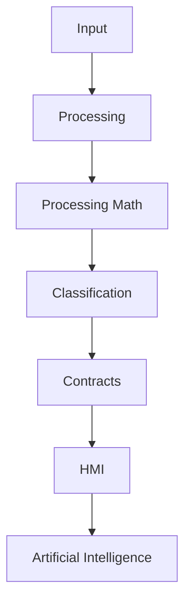
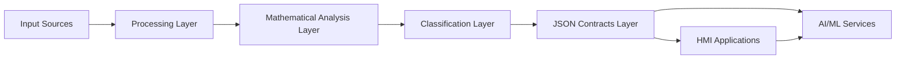

# TradElatin VR1 Architecture

## High-Level Flow

TradElatin VR1 follows a staged architecture that converts raw market inputs into structured intelligence for human and machine-assisted decision processes.

```text
Input
  ↓
Processing
  ↓
Processing Math
  ↓
Classification
  ↓
Contracts
  ↓
HMI
  ↓
Artificial Intelligence
```

## Mermaid: Pipeline Overview



## Stage Responsibilities

- **Input:** Acquires market data from live or simulated sources.
- **Processing:** Cleans, validates, and aligns incoming events.
- **Processing Math:** Applies signal processing and statistical transforms.
- **Classification:** Assigns contextual states and behavior categories.
- **Contracts:** Serializes outputs into consistent JSON contracts for downstream consumers.
- **HMI:** Presents operational insights through user-facing dashboards.
- **Artificial Intelligence:** Executes learning and inference loops using classified and contracted data.

## Mermaid: Data and Interaction Boundaries


